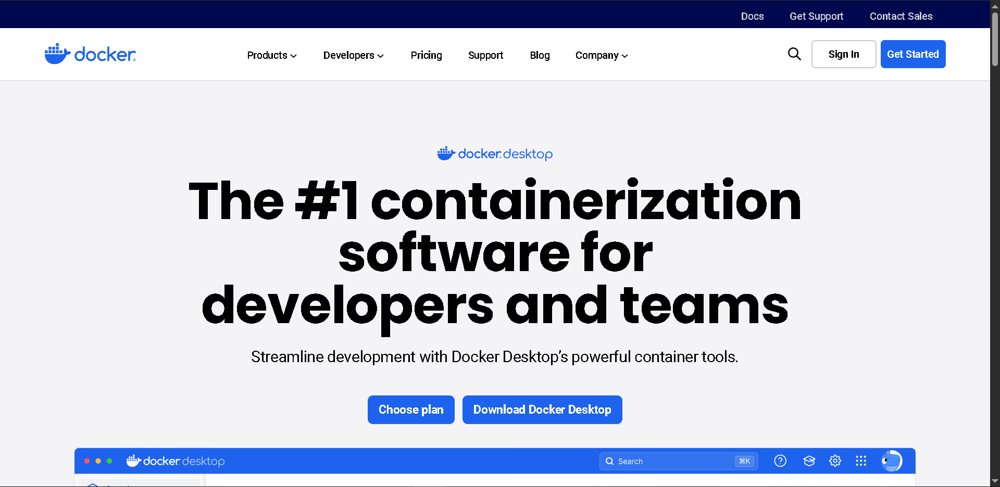

# Proyecto Docker - Introducción a Contenedores y Dockerfile

## Paso 1: Instalar Docker

💡 **¿Por qué empezamos por Docker?**  
Docker es la base de este proyecto. Aunque podríamos empezar por el código fuente, entenderás mejor todo si tienes Docker funcionando primero.

### Instalación de Docker Desktop

1. Ve al sitio oficial de [Docker](https://www.docker.com/products/docker-desktop/).
2. Haz clic en **Download Docker Desktop** y elige la versión adecuada para tu sistema operativo.

💡 **¿Cómo sé qué versión descargar?**

- **Mac:** Haz clic en el ícono de Apple → “About this Mac” → Mira si dice “Apple” o “Intel”.
- **Windows:** Abre *System Information* → Mira si dice “x64-based” o “ARM-based”.
- **Linux:** Ejecuta `uname -m` en la terminal. Si ves `x86_64`, es Intel/AMD. Si ves `aarch64` o `arm64`, es ARM.

💡 **¿Qué es Docker Desktop?**  
Es una interfaz gráfica que te permite gestionar contenedores fácilmente. Docker en sí es una herramienta de línea de comandos, y Docker Desktop lo complementa con una interfaz visual amigable.

💡 **¿Qué son los contenedores?**  
Los contenedores resuelven el típico problema de “funciona en mi máquina” al empaquetar el código y sus dependencias en un entorno aislado y portátil. Así se asegura que tu aplicación se comporte igual en cualquier equipo.

💡 **¿Qué hace Docker?**  
Docker te ayuda a crear, gestionar y desplegar contenedores. Piensa en él como una plataforma para construir barcos de carga (contenedores) y ponerlos en el agua (tu sistema operativo).

💡 **¿Qué se puede hacer en Docker Desktop?**

- **Containers:** Ver, iniciar y detener contenedores.
- **Images:** Administrar las plantillas de contenedores.
- **Volumes:** Almacenar datos persistentes de contenedores.
- **Builds:** Ver imágenes personalizadas creadas por ti.
- **Docker Scout:** Analiza imágenes en busca de vulnerabilidades.
- **Extensions:** Agrega herramientas adicionales de seguridad y monitoreo.

### Verifica que Docker esté correctamente instalado

Abre una terminal (en Windows: CMD o PowerShell; en Mac/Linux: Terminal) y ejecuta:

```bash
docker --version
```

Si ves una versión de Docker, ¡todo está listo! Si no, asegúrate de que Docker Desktop esté abierto y corriendo (busca el ícono 🐳 en tu barra de tareas).

#### Imágenes del Paso 1

  
  
  
  
  
  
  
  


---

## Paso 2: Ejecutar una Imagen Preconstruida

Ahora que tienes Docker instalado, vamos a crear un contenedor a partir de una imagen ya existente.

💡 **¿Qué es una imagen de contenedor?**  
Es una plantilla que define qué incluye un contenedor: código, librerías, archivos, etc. A partir de una imagen se pueden crear múltiples contenedores idénticos.

### Comando para crear un contenedor Nginx

Abre la terminal y ejecuta:

```bash
docker run -d -p 80:80 nginx
```

💡 **¿Qué hace este comando?**

- `docker run`: Crea un nuevo contenedor.
- `-d`: Ejecuta el contenedor en segundo plano (modo "detached").
- `-p 80:80`: Conecta el puerto 80 de tu computadora con el puerto 80 del contenedor.
- `nginx`: Es la imagen que estás usando (servidor web liviano y potente).

Después de ejecutar el comando, abre tu navegador y ve a [http://localhost](http://localhost). Deberías ver la página de bienvenida de Nginx.

#### Imágenes del Paso 2

  
  


💡 **¿Qué es Nginx?**  
Es un servidor web que entrega páginas web. También puede funcionar como servidor proxy para balanceo de carga.

💡 **¿Qué es Docker Hub?**  
Es un repositorio público de imágenes Docker, como una App Store para contenedores. Por ejemplo, puedes encontrar la imagen `nginx` en [Docker Hub](https://hub.docker.com/_/nginx).

---

## Paso 3: Crear tu Propia Imagen Personalizada

### 1. Crea una carpeta en tu Escritorio llamada `Compute`

```bash
cd ~/Desktop
mkdir Compute
```

📷  


### 2. Crea un archivo llamado `Dockerfile` (sin extensión)

```bash
cd Compute
# En Windows
type nul > Dockerfile.txt
# Luego, cambia el nombre quitando ".txt" o hazlo directamente desde tu editor
```

📷  
  


### 3. Agrega el siguiente contenido al Dockerfile

Abre `Dockerfile` con tu editor favorito (como VSCode o Notepad++) y copia lo siguiente:

```Dockerfile
FROM nginx:latest
COPY index.html /usr/share/nginx/html/
EXPOSE 80
```

📷  


💡 **Explicación del Dockerfile:**

- `FROM nginx:latest`: Usamos la imagen base de Nginx.
- `COPY index.html /usr/share/nginx/html/`: Reemplazamos la página por defecto con una personalizada.
- `EXPOSE 80`: Indicamos que nuestra app usará el puerto 80.

Guarda el archivo con `Ctrl + S` o `Cmd + S`.

---

### Crear la página web para tu contenedor

Ahora que tenemos listo tu Dockerfile, ¿qué página web debería servir tu contenedor Nginx? Vamos a crear un archivo HTML simple para este proyecto.

Ejecuta estos comandos en tu terminal para crear un nuevo archivo llamado `index.html`. Este archivo debe estar en el mismo directorio que tu Dockerfile.

```bash
type nul > index.html
```
(Asegúrate de estar en el escritorio dentro de la carpeta `Compute`)

📷  


💡 **¿Qué es un archivo HTML?**  
El archivo HTML determina cómo se verá tu página web. Es un documento que define la estructura, texto, imágenes y enlaces de tu página. Cuando Nginx abre tu archivo HTML, leerá el código y lo mostrará en el navegador del usuario.

Abre tu archivo `index.html` (recomiendo usar VSCode) y agrega este contenido de ejemplo:

> Nota: si al hacer doble clic se abre automáticamente en el navegador, asegúrate de hacer clic derecho sobre `index.html` y abrirlo con un editor de texto.

```html
<!doctype html>
<html>
  <head>
    <title>My Web App</title>
  </head>
  <body>
    <h1>Hello from YOURNAME's custom Docker image!</h1>
  </body>
</html>
```

📷  


💡 **¿Qué hace este `index.html`?**  
Este archivo mostrará a los visitantes un encabezado que dice:  
*"Hello from YOURNAME's custom Docker image!"*  
Lo verás funcionando pronto 👀

Revisa que tu `index.html` no tenga errores. En la carpeta `Compute`, haz clic derecho sobre `index.html` y selecciona *Abrir con* → tu navegador (ej. Google Chrome) para comprobar que se muestra correctamente.

---

### Construir la Imagen

Ahora, ¡vamos a construir la imagen!

Vuelve a la terminal local, asegúrate de estar dentro de la carpeta `Compute` y ejecuta:

```bash
docker build -t my-web-app .
```

📷  


En caso de error, usa este comando para renombrar el archivo Dockerfile si se creó con extensión `.txt`:

```bash
rename Dockerfile.txt Dockerfile
```

💡 **¿Qué significa construir una imagen?**  
Construir una imagen significa crear una imagen Docker usando las instrucciones dentro del Dockerfile. Docker usará esta imagen construida como plantilla para crear contenedores que ejecuten tu aplicación en cualquier lugar.

💡 **¿Qué hacen estos comandos?**  
- `-t my-web-app` le pone el nombre `my-web-app` a tu imagen.  
- El punto `.` le dice a Docker que busque el Dockerfile en el directorio actual, es decir, la carpeta `Compute`.

💡 **¿Qué significa la respuesta del terminal?**  
La respuesta en la terminal muestra los pasos que Docker ejecutó para construir tu imagen a partir del Dockerfile:  

- *Loading build definition:* Docker está cargando las instrucciones del Dockerfile para saber cómo construir la imagen.  
- *[1/2] FROM docker.io...:* Docker procesa la primera línea del Dockerfile (la imagen base nginx).  
- *[2/2] COPY index.html...:* Docker procesa la segunda línea, copiando el archivo `index.html` al sistema de archivos del contenedor.  
- *Exporting to image:* Docker combina todas las instrucciones aplicadas y prepara la imagen lista para correr contenedores.

---
```

## Paso 4: Ejecutar un contenedor con tu imagen personalizada

Para ejecutar una imagen, usa este comando:

```bash
docker run -d -p 80:80 my-web-app
```

📷  


💡 **¿Qué hace este comando?**  
Similar al comando que usamos antes, le estamos pidiendo a Docker que ejecute nuestra imagen `my-web-app` como un contenedor en segundo plano (`-d`), haciéndola accesible a través del puerto 80 en tu máquina local (`-p 80:80`).

---

### ¿Tuviste un error?

```
Error response from daemon: driver failed to remove network docker_default: Error
```

💡 **¿Por qué apareció este error?**  
Este error aparece cuando ya hay un contenedor usando el puerto 80, por lo que el nuevo contenedor que intentas crear no puede acceder a ese puerto.

Vamos a descubrir quién está usando el puerto 80 ahora mismo 🔎

---

### Forma 1: Usar Docker Desktop

Puedes encontrar el contenedor que está usando el puerto 80 volviendo a abrir Docker Desktop. El icono del contenedor debería ser verde si está en ejecución.

Ese es el contenedor Nginx que creaste cuando ejecutaste por primera vez:

```bash
docker run -d -p 80:80 nginx
```

¡Ya encontramos al culpable! 🧙‍♂️

📷  


Puedes detener ese contenedor seleccionando el icono cuadrado de “stop”. El icono del contenedor debería volverse gris.

📷  


---

### Forma 2: Usar la terminal

Otra forma de encontrar el contenedor que está usando el puerto 80 es ejecutando:

```bash
docker ps --filter "publish=80"
```

Tu terminal te mostrará el ID del contenedor bajo la columna `CONTAINER ID`.

📷  


Luego, detén el contenedor con:

```bash
docker stop {container_id}
```

Reemplaza `{container_id}` con el ID real del contenedor.

📷  


---

### Intenta ejecutar la imagen nuevamente:

```bash
docker run -d -p 80:80 my-web-app
```

📷  


¡Genial! Esta vez no hubo errores.

Abre tu navegador web y navega a [http://localhost](http://localhost) nuevamente. Si hicimos todo correctamente, deberías ver el contenido de nuestro archivo `index.html`.

📷  


## Paso 5: Inicia sesión en AWS con tu usuario IAM

📷  


## Paso 6: Despliega tu imagen personalizada en Elastic Beanstalk

Dirígete a la Consola de administración de AWS e inicia sesión con tu usuario IAM.  
Busca Elastic Beanstalk y haz clic en el servicio.  


💡 **¿Qué es Elastic Beanstalk?**  
AWS Elastic Beanstalk es un servicio que facilita el despliegue de aplicaciones en la nube sin preocuparte por la infraestructura subyacente. Solo subes tu código y Elastic Beanstalk se encarga de todo lo necesario para ejecutarlo, como configurar servidores y gestionar escalabilidad. Así puedes enfocarte en tu código sin manejar infraestructura directamente.

En términos técnicos, Elastic Beanstalk maneja:  
- Aprovisionamiento de capacidad  
- Balanceo de carga  
- Autoescalado  
- Monitoreo de salud de la aplicación  

💡 **¿Cómo se relaciona Elastic Beanstalk con contenedores y Docker?**  
Elastic Beanstalk puede ejecutar aplicaciones empaquetadas como contenedores Docker. Esto te permite desarrollar localmente, crear una imagen Docker con todo lo necesario para correr tu app y luego desplegarla fácilmente en Elastic Beanstalk.

---

Haz clic en **Create Application** en la página principal de Elastic Beanstalk.  


💡 **¿Qué es una aplicación en Elastic Beanstalk?**  
Una aplicación es como una carpeta que contiene todas las versiones de un proyecto desplegado y la configuración usada.

---

En la página de configuración:  
- Deja el **Environment tier** por defecto.  

💡 **¿Qué es un entorno (environment) en Elastic Beanstalk?**  
Es la configuración para las máquinas virtuales (EC2) que ejecutarán tu aplicación: tipo de instancia, escalado, redes, etc.

- Pon **Dockerdemoapp** como nombre de aplicación.  
- Deja la sección Environment information con valores por defecto.  


---

En la sección **Platform**, selecciona **Docker** como plataforma.  
La rama y versión de la plataforma se seleccionan automáticamente.  


💡 **¿Qué significa plataforma?**  
Es la tecnología que ejecuta tu aplicación. Elegimos Docker porque es la mejor opción para imágenes Docker.

---

En la sección **Application code**, selecciona **Upload your code**.  


Antes de subir cualquier código, regresa a la carpeta Compute en tu escritorio y abre el archivo index.html con tu editor de texto.  
Encuentra la línea que dice <h1>Hello from YOURNAME's custom Docker image!</h1>  
Actualiza index.html agregando una nueva línea justo debajo de la línea que encontraste. Por ejemplo:

<!doctype html>
<html>
  <head>
    <title>Mi Aplicación Web</title>
  </head>
  <body>
    <h1>Hello from YOURNAME's custom Docker image!</h1>
    <h1>
      Si puedo ver esto, significa que Elastic Beanstalk ha desplegado una imagen con
      mi trabajo.
    </h1>
  </body>
</html>


Elastic Beanstalk necesita que tu código fuente esté en un archivo ZIP. Crea un archivo ZIP que contenga Dockerfile e index.html.  
Tus archivos deben estar en el nivel raíz del archivo ZIP, no dentro de una subcarpeta.  
Para crear tu archivo ZIP, en la carpeta Compute, selecciona ambos archivos Dockerfile e index.html y comprímelos juntos.


Regresa a la página de configuración de Elastic Beanstalk, ingresa **Version One** como etiqueta de versión.  
Selecciona **Archivo local (Local file)**.  
En **Upload application**, selecciona **Choose file**.  
Carga el archivo ZIP que creaste anteriormente. Esto sube el código de tu aplicación a Elastic Beanstalk.

  


En la sección Presets, elige **Single instance (Free tier eligible)**.  

💡 **Extra para expertos: ¿Qué son los Presets?**  
Al seleccionar un preset, eliges una forma predefinida recomendada por AWS para configurar Elastic Beanstalk.  
El preset Single instance crea una única instancia EC2, ideal para pruebas y elegible para el Free Tier.  
Otros presets se adaptan a diferentes escenarios y necesidades. Por ejemplo, alta disponibilidad ofrece herramientas para manejar rápidamente cambios en el volumen de tráfico, ideal para aplicaciones en producción y uso público.  

Selecciona **Next**.


In the Configure service access page:  
Hay que crear 2 roles para nuestros servicios  
Presiona Create Role  
  
Sigue los pasos de las imagenes siguientes:  
  
Permisos que Beanstalk tendra por defecto al seleccionar Create Role  
AWSElasticBeanstalkEnhancedHealth  
AWSElasticBeanstalkManagedUpdatesCustomerRolePolicy  
Cuando creas un Environment de tipo "Single Instance" en Elastic Beanstalk, y estás seleccionando o creando un EC2 instance profile (rol de instancia EC2), Elastic Beanstalk te sugiere al menos estas dos políticas:  
1. AWSElasticBeanstalkEnhancedHealth  
🔍 Permite a la instancia reportar información detallada de salud a Elastic Beanstalk.  
📈 Es necesaria para el monitoreo de salud mejorado.  
2. AWSElasticBeanstalkManagedUpdatesCustomerRolePolicy  
🔄 Permite a Beanstalk aplicar actualizaciones administradas en tu entorno.  
🛡️ Asegura que EB pueda verificar si es seguro aplicar parches o nuevas versiones.  
dale next  
  
Aqui solo dale Create Role y deja todo por defecto  
  
Primer rol creado, ahora vamos con el otro...  
  
Vuelve a Beanstalk y toca Create Rol para el perfil de la instancia  
  
Sigue las siguientes imagenes...  


Añadiremos AWSElasticBeanstalkWebTier  
y el rol AmazonEC2ContainerServiceRole  
Permite a la instancia EC2 interactuar con otros servicios como S3, CloudWatch, etc.

Es parte del uso común de aplicaciones web desplegadas en Beanstalk.  
  
  
Ahora avanza hasta crear el rol con éxito  
  
Ahora ya verás los 2 roles listos, no necesitaremos pares de claves en esta demo  

💡 ¿Qué es un service role?  
Un service role es un rol IAM de AWS que permite a Elastic Beanstalk llamar a otros servicios de AWS en tu nombre.

💡 ¿Por qué Elastic Beanstalk necesita un nuevo service role?  
Uno de los beneficios de Elastic Beanstalk es que puede manejar la infraestructura en la nube de tu aplicación por ti, y solo puede hacerlo si tiene permiso para usar tus recursos AWS automáticamente, por ejemplo, creando una nueva instancia EC2. También ayuda a automatizar tareas como el escalado y el monitoreo de salud.

💡 ¿Qué es un instance profile?  
Un instance profile es otro rol IAM (similar a los service roles), pero está diseñado para dar a las instancias EC2 permiso para acceder a otros servicios AWS que tu aplicación pueda necesitar para funcionar.

💡 Extra para expertos: ¿Qué hace ecsInstanceRole?  
El ecsInstanceRole otorga a las instancias EC2 permiso para gestionar contenedores usando AWS Elastic Container Service (ECS).  
Mientras Docker construye y ejecuta contenedores, piensa en ECS como un administrador que ayuda a Elastic Beanstalk a decidir cuántos contenedores iniciar y detener, basado en la cantidad de tráfico hacia tu aplicación.  
  

En la página de configuración de red, base de datos y etiquetas (Set up networking, database, and tags):  
Ignora la sección Virtual Private Cloud – la VPC por defecto es adecuada para este proyecto.  
En Configuración de instancia (Instance settings), marca Activada (Activated) para la opción Dirección IP pública (Public IP address).  

💡 ¿Qué hace activar una dirección IP pública?  
Esto hace que tus instancias EC2 y tu aplicación sean accesibles desde Internet – ¡emocionante!  

Sáltate el resto de la página, no necesitamos configurar una base de datos para nuestra página web.  
Selecciona Next.  


Para la página Configure instance traffic and scaling:  
En la sección Instances, para Root volume type selecciona General Purpose 3 (SSD).  
Para Size selecciona 10 GB.  

💡 Extra para expertos: ¿Qué significa root volume type?  
El root volume type es el espacio de almacenamiento de tu instancia EC2, como el disco duro de tu computadora local donde se guarda el sistema operativo y archivos.  
General Purpose 3 (SSD) es elegible para Free Tier y es adecuado para la mayoría de las aplicaciones.  
Otros tipos son para casos especiales, como Provisioned IOPS SSD (io1/io2) para bases de datos de alto rendimiento, o Cold HDD (sc1) para almacenamiento a largo plazo.  

En Instance metadata service (IMDS), asegúrate que IMDSv1 esté Desactivado (mantén la casilla Deactivated marcada).  

💡 Extra para expertos: ¿Qué es Instance metadata service (IMDS)?  
IMDS es un servicio que otorga credenciales temporales a tus aplicaciones en las instancias EC2. Por ejemplo, para permitir acceso a S3 desde tu app.  
  

Como nuestra app no necesitará acceso a otros servicios AWS, no necesitamos IMDS.  
No es necesario configurar nada más. Salta las secciones Security groups y Capacity.  

💡 Extra para expertos: ¿Qué hacen estas configuraciones?  
Los security groups controlan el tráfico, mientras que Capacity controla la capacidad de cómputo del entorno y la configuración de autoescalado para optimizar el número de instancias usadas.  

Selecciona Next.  

  

En la página Configure updates, monitoring, and logging:  
En la sección Monitoring, selecciona Basic para tu System.  
🚨 Asegúrate de seleccionar Basic para mantener el proyecto gratis. 🚨  

💡 Extra para expertos: ¿Qué son monitoring y health reporting?  
Son herramientas que te dan actualizaciones de rendimiento y estado de tu aplicación Elastic Beanstalk para detectar problemas antes que afecten a los usuarios.  
  

Desplázate a la sección Managed platform updates.  
Asegúrate de desmarcar la casilla Activated para la opción Managed updates.  

💡 Extra para expertos: ¿Qué hacen los managed updates?  
Actualizan automáticamente el software que corre tu aplicación en Elastic Beanstalk, por ejemplo Docker, para mantenerla segura y estable sin actualizaciones manuales.  
  

Ahora en Rolling updates and deployments, acepta la política predeterminada All at once deployment.  

💡 Extra para expertos: ¿Qué son los application deployments?  
Son los procesos para mover una nueva versión de software a producción en Elastic Beanstalk: subir código, configurar opciones, y reemplazar la versión antigua por la nueva que ven los usuarios.  
Hay dos tipos principales de deployment policies:  
- All at once: actualiza todas las instancias al mismo tiempo, generando un breve downtime.  
- Rolling updates: actualiza instancias gradualmente, minimizando downtime.  
  

Deja todas las demás opciones, incluyendo Platform software, con sus valores por defecto.  

💡 Extra para expertos: ¿Qué es platform software?  
Es el software que corre en las instancias de Elastic Beanstalk. Por ejemplo, Elastic Beanstalk configura Nginx como servidor proxy por defecto para manejar el tráfico entrante y pasarlo a las instancias EC2 que corren tu app, y luego enviar las respuestas al usuario.  

Selecciona Next.  
  

Para el paso final, solo queda revisar la configuración de Elastic Beanstalk. Aquí se resumen tus elecciones en las últimas cinco páginas.  

Hagamos un checklist rápido:  
- ¿Application name es NextWork App?  
- ¿Application code es un archivo zip?  
- ¿EC2 instance profile está en ecsInstanceRole?  
- ¿Public IP address está en true?  
- ¿Root volume type es gp3?  
- ¿Environment type es Single instance?  
- ¿System está en basic?  
- ¿Managed updates está desactivado?  
- ¿Deployment policy es AllAtOnce?  

Haz clic en Submit. Esto inicia el proceso de creación del entorno y despliegue de la aplicación. Este proceso puede tardar varios minutos...  

  
  
